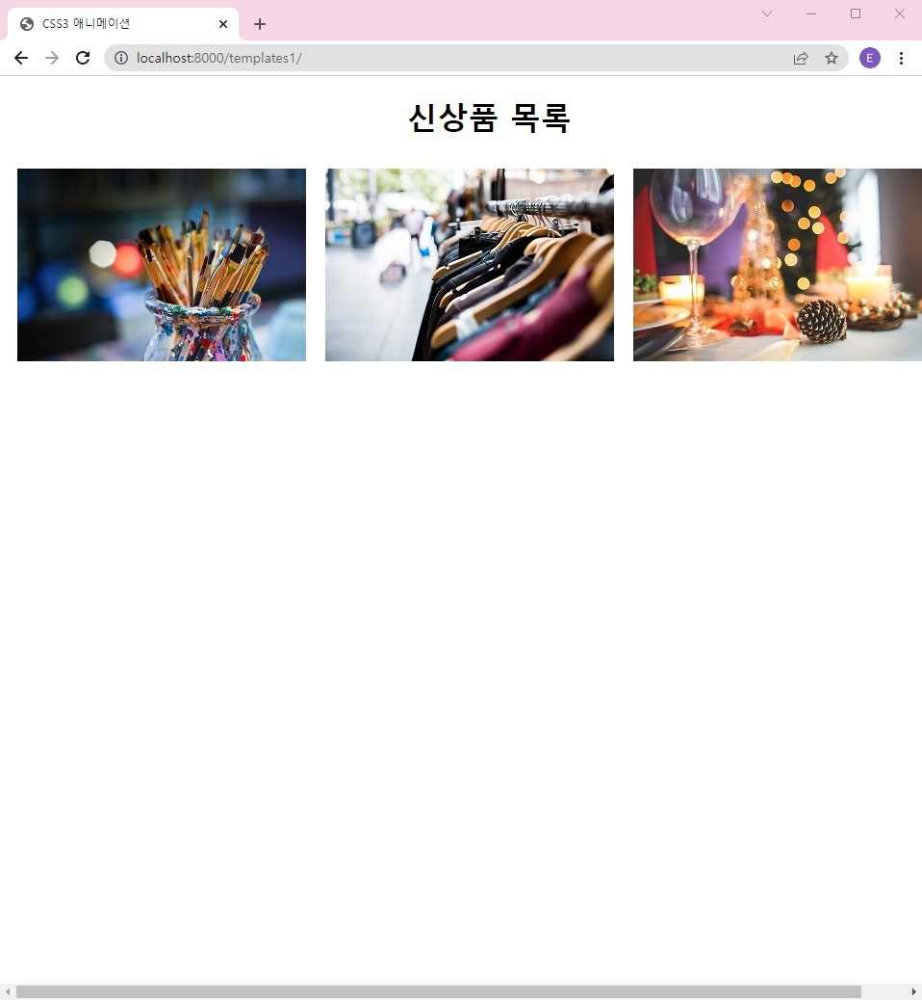

# '파이참 프로젝트' 만들기!
 파이참의 프로젝트를 우선 만들어야 그 다음 django 또는 flask 등의 프레임워크를 선택한다.

## 설명
쟝고 기준

#### 파이참의 파이썬 앱을 위한 가상환경 만들기
1. 파이참 프로젝트를 위한 가상환경_venv_을 만든다. 

그리고, 파이참 프로젝트를 위한 main.py 자동생성되도록 설정되어있다. 바꿔도 된다.
```
primary_pycharm_prj
-main.py
-venv
```
#### 쟝고 프레임워크 다운로드
2. 터미널 상(쉘 프롬트)에서 현재 가상환경에 'django' 프레임워크 다운로드

우선 버전 체크를 통한 유무 확인

python -m django --version

pip install django

#### 쟝고 프로젝트 만들기
3. 터미널 상에서 django 프로젝트 만들기

django-admin startproject django_prj

하면 django_prj라는 쟝고 프로젝트 디렉토리가 생기고
```
primary_pycharm_prj
-django_prj
--django_prj
--manage.py
```
하위에 django_prj 폴더와 manage.py 파일가 생김

django_prj에는 여러 설정파일이 있으므로 config로 이름 변경 추천

```
primary_pycharm_prj
-django_prj
--config
--manage.py
```

#### 쟝고 프로젝트 작동 확인
터미널에서 django_prj 디렉토리로 이동 후 runserver 체크

cd django_prj

python manage.py runserver

또는

py manage.py runserver

포트 8000

runserver로 sqlite 자동 생성됨

#### 쟝고 프로젝트 내부에 앱 만들기
django_prj에 앱 만들고, 쟝고프로젝트에 연결

python manage.py startapp ui

```
primary_pycharm_prj
-django_prj
--config
--ui
--manage.py
```

#### 쟝고프로젝트와 앱 연결

ui 디렉토리 하위 views.py에서

```
from django.http import HttpResponse

def index(request):
    return HttpResponse("Hello,i am views.py of ui app of django_prj")
```

추가 후, ui 디렉토리 하위에 urls.py 생!성! 및 설정

```
from django.urls import path

from . import views

urlpatterns = [
    path('', views.index, name='index'),
]
```

그 다음 django_prj 하위 config 디렉토리 하위 , urls.py 파일의 주석에 따라

urlpatterns에 경로 설정 및 추가

```
...

from ui import views

urlpatterns = [
    path('', views.index, name='index'),

    path('admin/', admin.site.urls),
]

```

# Next 
[django_and_sqlite](django_and_sqlite.md)

[django_and_UI(html+css+js)](django_and_UI.md)

# 최종결과화면



# 참고자료
https://docs.djangoproject.com/ko/4.0/intro/tutorial01/