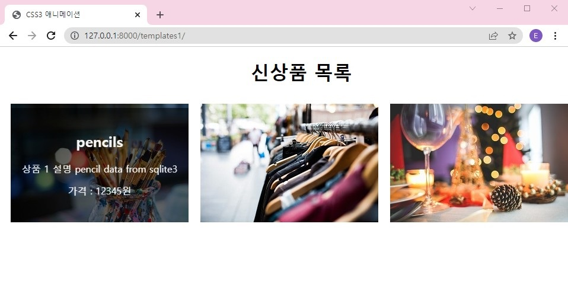
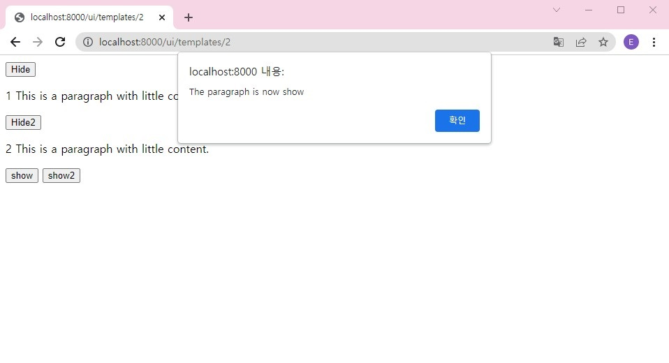

# pycharm에서 django APP 만들기 
[django_and_pycharm](django_and_pycharm_prj.md)

[django_and_sqlite](django_and_sqlite.md)

[django_and_UI(html+css+js)](django_and_UI.md)

# UI examples
## html

Static 설정을 통한 css, img 적용

## Jquery 

cdn 기반 jquery 참조
 + html 파일 내부 jquery function 코딩
 + Static 설정을 통한 jquery 적용

# 참고자료
https://docs.djangoproject.com/ko/4.0/intro/tutorial01/